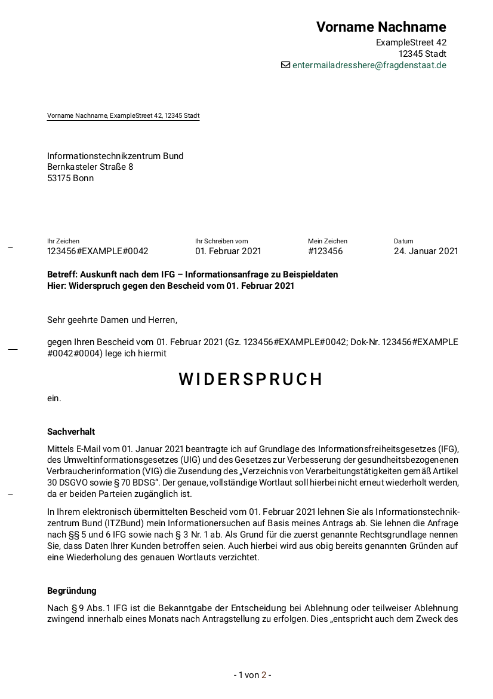

**[English translation](./README.md)**

# ifg-letter-appeal

Eine [LaTeX](https://www.latex-project.org/)-Vorlage für Einsprüche gegen ablehnende Bescheide von Behörden auf IFG-Anfragen (siehe [Informationsfreiheitsgesetz](https://de.wikipedia.org/wiki/Informationsfreiheitsgesetz)).
Erstellt für und vorgeschlagen zur Verwendung mit [FragDenStaat](https://fragdenstaat.de/).

Derzeit nur in deutsch verfügbar.

## Beispiel

Der enthaltene Text ist hauptsächlich als Beispiel gedacht. Außerdem enthält er einige allgemeine Argumente/Boilerplate-Text, der wiederverwendet werden kann.

Die [PDF dieser zusammengestellten Vorlage kann auch heruntergeladen werden](https://github.com/rugk/ifg-letter-appeal/releases/latest).

## Erstellen

Wir empfehlen eine aktuelle Tex-Distribution, z. B. TexLive 2020. Die verwendete [Schriftart hat in älteren Versionen einen Anzeige-Bug](https://tex.stackexchange.com/q/578223/98645).
Außerdem wird LuaLaTeX empfohlen (es sollten aber auch andere LaTeX-Compiler funktionieren)

Die Datei `me-agency.lco.example` im Ordner `sender` muss zu zu `me-agency.lco` umbenannt werden, damit der Buildvorgang funktioniert.

## Struktur

* [`sender/`](sender/) enthält die Daten des Absenders (d. h. deine Daten), die du einbinden möchtest.
* [`receiver/`](receiver/) enthält die Kontaktdaten des Empfängers (d. h. der Behörde).
* [`sender.lco`](sender.lco) enthält allgemeine Einstellungen, die entscheiden wie der Absender dargestellt wird.
* [`ifg-letter-appeal.tex`](ifg-letter-appeal.tex) ist der Haupteinstiegspunkt. Verwende ihn, um den Brief zu erzeugen.

## Credits

Der Briefstil ist größtenteils dank [`scrletter`](https://www.ctan.org/pkg/scrletter)/[`scrlttr2`](https://www.ctan.org/pkg/scrlttr2), d.h. den LaTeX [KOMA-Script](https://komascript.de/)-Klassen möglich.

Danke auch an die großartige [Stackexchange Tex](https://tex.stackexchange.com/)-Gemeinschaft. (Verwendete Fragen/Antworten sind meist als Kommentare verlinkt).

## Weitere hilfreiche Links

* [Wie ist die Frist bei Widersprüchen zu berechnen?](https://forum.okfn.de/t/berechnung-interpretation-der-monatsfrist-fuer-einen-widerspruch/943?u=rugk) Erklärt auch die Formerfordernisse.  
* [CTAN-Seite für `scrletter`] (https://www.ctan.org/pkg/scrletter) mit Links zur Dokumentation von KOMA-Script (`scrguide.pdf`) in Deutsch und Englisch.
* [Andere Briefvorlagen in anderen Formaten](https://forum.okfn.de/t/briefvorlage-fuer-widersprueche/900?u=rugk) im OKFN/FragDenStaat-Forum.

## Rechtshinweis

Dies stellt keine Rechtsberatung dar. Die verwendeten Texte stellen nur Beispiele dar und sollten vor jeder Verwendung auf ihre Anwendung geprüft werden.

DIE SOFTWARE WIRD OHNE MÄNGELGEWÄHR UND OHNE JEGLICHE AUSDRÜCKLICHE ODER STILLSCHWEIGENDE GEWÄHRLEISTUNG, EINSCHLIEßLICH, ABER NICHT BESCHRÄNKT AUF DIE GEWÄHRLEISTUNG DER MARKTGÄNGIGKEIT, DER EIGNUNG FÜR EINEN BESTIMMTEN ZWECK UND DER NICHTVERLETZUNG VON RECHTEN DRITTER, ZUR VERFÜGUNG GESTELLT. DIE AUTOREN ODER URHEBERRECHTSINHABER SIND IN KEINEM FALL HAFTBAR FÜR ANSPRÜCHE, SCHÄDEN ODER ANDERE VERPFLICHTUNGEN, OB IN EINER VERTRAGS- ODER HAFTUNGSKLAGE, EINER UNERLAUBTEN HANDLUNG ODER ANDERWEITIG, DIE SICH AUS, AUS ODER IN VERBINDUNG MIT DER SOFTWARE ODER DER NUTZUNG ODER ANDEREN GESCHÄFTEN MIT DER SOFTWARE ERGEBEN.  

<!-- Diese Vorlage ist lizenziert unter der Lizenz Creative Commons Attribution 4.0 International (CC-BY), siehe: https://creativecommons.org/licenses/by/4.0 -->

<a property="dct:title" rel="cc:attributionURL" href="https://github.com/rugk/ifg-letter-appeal">ifg-letter-appeal</a> by <a rel="cc:attributionURL dct:creator" property="cc:attributionName" href="https://github.com/rugk">rugk</a> ist lizenziert unter der Lizenz <a href="https://creativecommons.org/licenses/by/4.0/?ref=chooser-v1" target="_blank" rel="license noopener noreferrer" style="display:inline-block;">Creative Commons Attribution 4.0 International (CC-BY)</a>.

