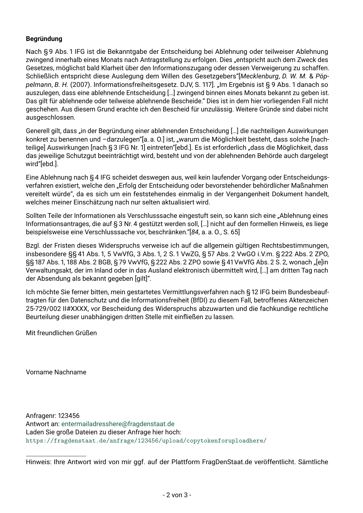

**[German translation](./README-de.md)**

# ifg-letter-appeal

A [LaTeX](https://www.latex-project.org/) template for appeals to official notifications of agencies to (German) “Freedom of information” (FOI) requests, in German the [Informationsfreiheitsgesetz](https://de.wikipedia.org/wiki/Informationsfreiheitsgesetz) (IFG).
Created for and suggested to be used with [FragDenStaat](https://fragdenstaat.de/).

Currently only available in German.

## Example

The included text is mostly intended as an example. Also, it includes some common arguments/boilerplate text you may re-use.

The [PDF of this compiled template can also be downloaded](https://github.com/rugk/ifg-letter-appeal/releases/latest).

## Building

We recommend a current Tex distribution, e.g. TexLive 2020. The used [font has a display bug in older versions](https://tex.stackexchange.com/q/578223/98645).
LuaLaTeX is also recommended (but other LaTeX compilers should work as well).

The file `me-agency.lco.example` in the folder `sender` must be renamed to `me-agency.lco` for the build process to work.

## Structure

* [`sender/`](sender/) contains the sender's data (i.e. your data) you want to include.
* [`receiver/`](receiver/) contains the contact data of the receiver (i.e. the agency).
* [`sender.lco`](sender.lco) contains general settings about how the sender is displayed.
* [`ifg-letter-appeal.tex`](ifg-letter-appeal.tex) is the main entry point. Use it to generate the letter.

## Credits

The letter style is mostly made possible thanks to [`scrletter`](https://www.ctan.org/pkg/scrletter)/[`scrlttr2`](https://www.ctan.org/pkg/scrlttr2), i.e. the LaTeX [KOMA-Script](https://komascript.de/) classes.

Also thanks to the awesome [Stackexchange Tex](https://tex.stackexchange.com/) community. (Used questions/answers are usually linked as comments.)

## Other helpful links

* [How to calculate the time limit for appeals?](https://forum.okfn.de/t/berechnung-interpretation-der-monatsfrist-fuer-einen-widerspruch/943?u=rugk) (German) Also explains the formal requirements.
* [CTAN page for `scrletter`](https://www.ctan.org/pkg/scrletter) with links to the documentation of KOMA-Script of (`scrguide.pdf`) in German and English.
* [Other letter templates in other formats](https://forum.okfn.de/t/briefvorlage-fuer-widersprueche/900?u=rugk) (German) in the OKFN/FragDenStaat forum.

## Legal notice

This does not constitute legal advice. The texts used are only examples and should be checked for their application before each use.

THE SOFTWARE IS PROVIDED "AS IS", WITHOUT WARRANTY OF ANY KIND, EXPRESS OR IMPLIED, INCLUDING BUT NOT LIMITED TO THE WARRANTIES OF MERCHANTABILITY, FITNESS FOR A PARTICULAR PURPOSE AND NONINFRINGEMENT. IN NO EVENT SHALL THE AUTHORS OR COPYRIGHT HOLDERS BE LIABLE FOR ANY CLAIM, DAMAGES OR OTHER LIABILITY, WHETHER IN AN ACTION OF CONTRACT, TORT OR OTHERWISE, ARISING FROM, OUT OF OR IN CONNECTION WITH THE SOFTWARE OR THE USE OR OTHER DEALINGS IN THE SOFTWARE. 

<!-- This template is licensed under the Creative Commons Attribution 4.0 International (CC-BY) license, siehe: https://creativecommons.org/licenses/by/4.0 -->

<a property="dct:title" rel="cc:attributionURL" href="https://github.com/rugk/ifg-letter-appeal">ifg-letter-appeal</a> by <a rel="cc:attributionURL dct:creator" property="cc:attributionName" href="https://github.com/rugk">rugk</a> is licensed under <a href="http://creativecommons.org/licenses/by/4.0/?ref=chooser-v1" target="_blank" rel="license noopener noreferrer" style="display:inline-block;">Creative Commons Attribution 4.0 International (CC-BY)</a>.
 
